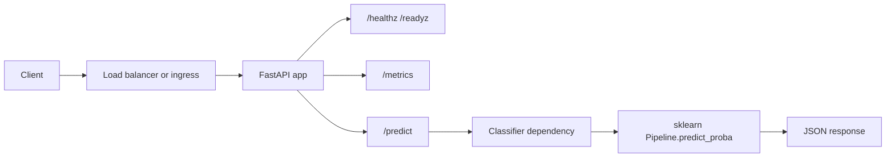

# AegisML architecture

## Service components

| Layer | Location | Responsibility |
|-------|----------|----------------|
| HTTP | `app/api/`, `app/main.py` | Routes, lifespan, exception handlers |
| Contracts | `app/schemas/` | Pydantic request/response and error models |
| Inference | `app/inference/` | sklearn `Pipeline` (TF–IDF + logistic regression); loaded once at startup |
| Config | `app/config.py`, `app/deployment.py` | Listen/bind settings; version / environment / git SHA for logs and metrics |
| Observability | `app/observability/` | Prometheus metrics middleware; optional OTLP when OTel extras are installed |
| Policy (batch) | `scripts/policy_check.py` | Deterministic checks over repo YAML/CI; not on the inference request path |
| Retrieval (optional) | `src/retrieval/` | Chroma-backed enrichment for policy findings; separate optional install |

## Request flow

- **Liveness**: `GET /healthz` — process responding.
- **Readiness**: `GET /readyz` — classifier initialized (after lifespan warmup).
- **Inference**: `POST /predict` with JSON `{"text":"..."}` — validation → singleton classifier → sorted per-class scores in response.

## Runtime dependencies

Declared in `pyproject.toml` (install via `pip install -e .`):

| Dependency | Role |
|------------|------|
| `fastapi`, `uvicorn` | ASGI API and server |
| `pydantic` | Settings and schema validation |
| `numpy`, `scikit-learn` | Vectorization and classification |
| `prometheus-client` | `/metrics` exposition |

Optional extras: `[dev]` (pytest, ruff, pip-audit), `[otel]` (tracing), `[retrieval]` (Chroma).

Container image: see `docker/Dockerfile` — slim Python base, non-root user, `tini`, healthcheck against `/healthz`.

## Future integration points

### CI/CD

- **GitLab**: root `.gitlab-ci.yml` composes lint, test, Kaniko build, security scans, policy job. Natural extensions: signed attestations (cosign), SBOM export, environment-scoped variables for image tags (`AEGISML_IMAGE_NAME`, `CI_COMMIT_TAG`).
- **Promotion**: add a `deploy` stage after `security` with `needs` on image scan + policy; pass the same image digest to Helm/Kustomize or Argo CD parameters.

### Kubernetes

- **Manifests**: `k8s/` — Service, Deployment, ConfigMap; overlays for dev/prod. Replace image registry placeholders with your registry path; wire **readiness** to `/readyz` and **liveness** to `/healthz` (already aligned in base manifests).
- **GitOps**: `k8s/argo/application-example.yaml` is a template — point `spec.source.path` at this repo and sync strategy as required.
- **Admission / policy**: runtime enforcement (OPA Gatekeeper, Kyverno) is out of band; CI policy remains the shift-left gate.

### Observability

- **Metrics**: Prometheus scrapes `/metrics` (histograms and counters prefixed `aegisml_*`). Sample scrape config and Grafana JSON live under `observability/`.
- **Tracing**: set `OTEL_EXPORTER_OTLP_ENDPOINT` and install `[otel]`; service name via `OTEL_SERVICE_NAME` (see `app/observability/telemetry.py`).
- **Logs**: structured startup line from `app/deployment.py`; correlate with `aegisml_app_info` labels in Prometheus.

## Boundaries

- **Policy script** reads the working tree and config files; it does not call the inference API.
- **Retrieval** is optional and used from `scripts/policy_check.py` enrichment path when installed; it does not affect classifier labels or CI verdict logic for the core policy rules.
